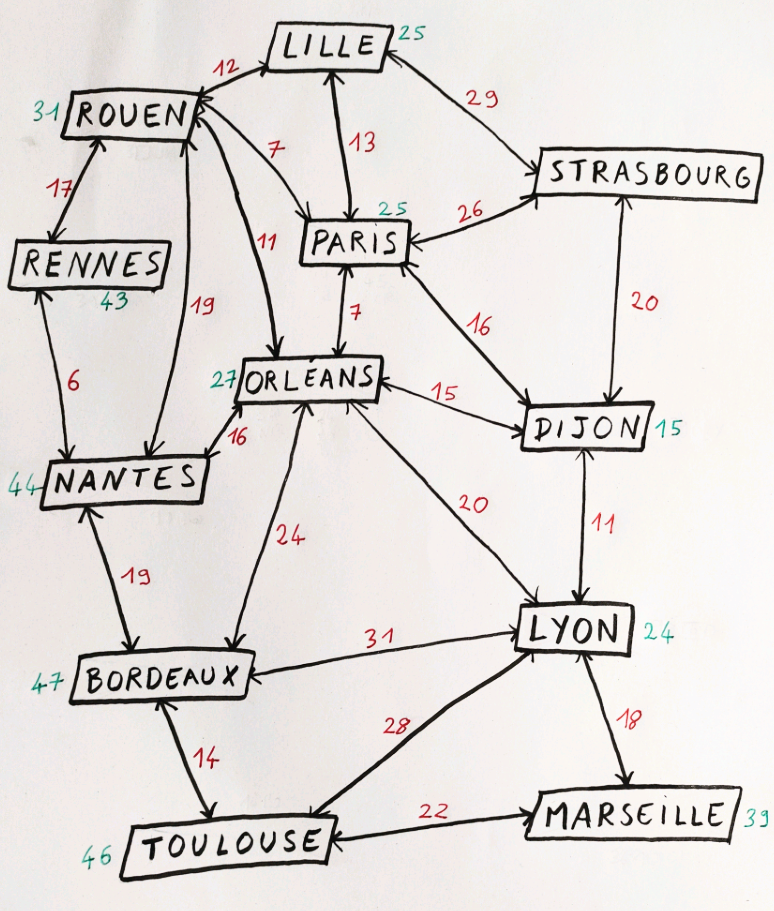
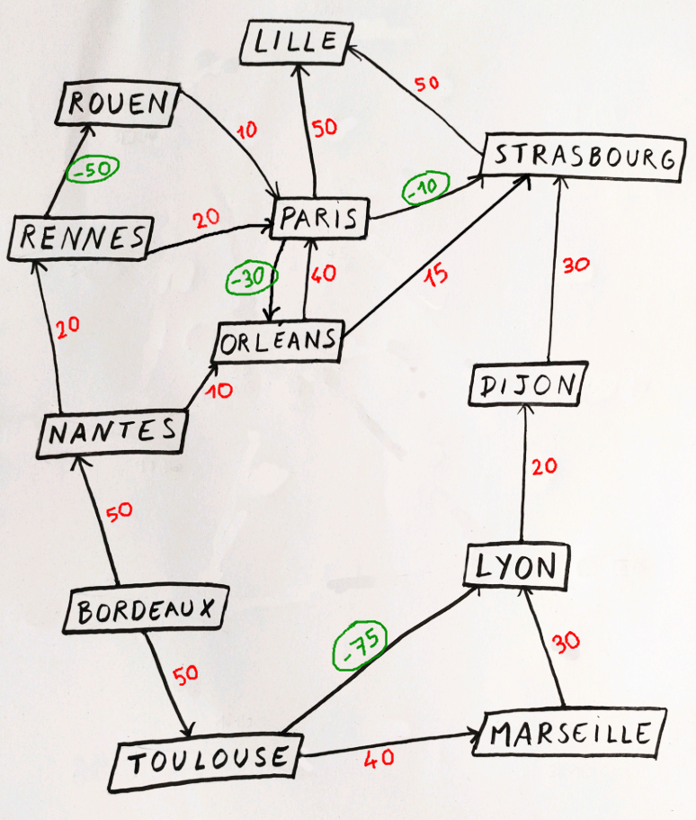

# TP : algorithmes de plus court chemin

Dans ce TP, nous aborderons plusieurs stratégies permettant de trouver le plus court chemin dans un graphe, en fonction des propriétés de ce dernier.

Pour commencer, effectuez un fork de ce repository et clonez-le. Votre rendu sera une pull request de votre fork vers le repository d'origine.

## Partie 1 : Recherche du plus court chemin avec Dijkstra

Étudions un cas pratique. Voici un graphe représentant les chefs-lieux de France continentale.


Une connexion est faite entre les chefs-lieux des régions contiguës. Le chiffre associé représente le **nombre d'heures à vélo** (sans les pauses...).

Toujours à la recherche de nouveaux exploits à accomplir, vous décidez de partir de Bordeaux pour rejoindre Strasbourg en empruntant les chemins décrits sur cette carte.

### 1.a Résolution manuelle

Commencez par trouver ce qui vous semble être le plus court chemin sans technique particulière. Notez votre réponse.

### 1.b Algorithme de Dijkstra

Sans l'implémenter pour le moment, trouvez le plus court chemin en utilisant manuellement l'algorithme de Dijkstra.

Notez chaque étape de votre raisonnement sur une feuille ou un document texte pour bien vous familiariser avec l'algorithme.

Comparez avec votre réponse précédente.

### 1.c Implémentation

Suivez précisément les étapes de mise en place :

#### Enumeration

Créez un fichier `pathfinder/city.py`.
À l'intérieur, créez une [énumération](https://docs.python.org/fr/3/library/enum.html) qui vous permettra d'avoir des constantes correspondant au nom de chaque ville.

Voici à quoi devrait ressembler le début de votre énumération :

```py
class City(Enum):
    BORDEAUX = "Bordeaux"
    DIJON = "Dijon"
    LILLE = "Lille"
    ...
```

Maintenant, vous pouvez utiliser des variables du type `City.BORDEAUX`, qui "représente" la string `"Bordeaux"` est qui est de type `City`.

Cela est plus propre que de passer des strings non typées et qui ne sont pas nécessairement prises en charge par notre programme.

Dans vos print, vous pouvez afficher la valeur associée ainsi :

```py
print(City.BORDEAUX.name)
```

#### Graphe

Créez un fichier `pathfinder/graph.py`.

En utilisant l'énumération `City` que vous avez créée, stockez dans une variable `graph` la **liste d'adjacences** du graphe dont l'image est présentée plus haut.

Pour vous aider, voici à quoi devrait ressembler le début du graph :

```py
graph = {
    City.BORDEAUX: {
        City.NANTES: 19,
        City.ORLEANS: 24,
        City.LYON: 31,
        City.TOULOUSE: 14
    },
    City.DIJON: {
        City.STRASBOURG: 20,
        City.PARIS: 16,
        City.ORLEANS: 15,
        City.LYON: 11
    },
    City.LILLE: {
        City.ROUEN: 12,
        City.PARIS: 13,
        City.STRASBOURG: 29
    },
    ...
```

C'est long et répétitif. Courage.

_Note : les types Python natifs ne permettent pas de typer des objets aussi complexes. Il faudra nous en passer !_

#### Type Path

Créez un fichier `pathfinder/path.py`.

Ce fichier sera très court. À l'aide de `TypedDict`, déclarez un type `Path`.

Ce type représentera l'objet qui contient la réponse au problème donné. Il contient deux membres :

- `total` qui est un `float` représentant la distance ou le coût total du trajet
- `steps` qui est une liste de ville `City` par lesquelles nous devons passer. **La ville de départ et la ville d'arrivée doivent être incluses dans la réponse**.

#### Classe PathFinder

Passons enfin au fichier principal : `pathfinder/pathfinder.py`. Attention, il s'agit d'un nouveau fichier à créer, à ne pas confondre avec celui déjà présent à la racine.

Nous allons utiliser les classes pour structurer notre code. En effet, les autres algorithmes que nous verrons par la suite sont très similaire à Dijkstra. Aussi, il sera intéressant **d'étendre** la classe **PathFinder** pour implémenter ces nouveaux algorithmes.

Pour le moment, contentez vous de déclarer une classe `PathFinder`. Le constructeur de cette classe prend en paramètre une variable `graph`.

Dans votre fichier racine `pathfinder.py`, vous pourrez donc instancier la classe ainsi :

```
pathfinder = PathFinder(graph)
```

Essayez !

#### Méthode get_shortest_path

La classe `PathFinder` possède une unique méthode publique : `get_shortest_path`.

Cette méthode prend en paramètre `start` et `end`, qui sont deux villes de type `City`.

Et maintenant, le challenge : grâce à cette méthode et des sous-méthodes privées, retourner un objet de type `Path` qui contient la solution optimale au trajet demandé.

_Conseil : `print` est votre ami. Reprenez votre résolution manuelle et comparer scrupuleusement les étapes avec celles effectuées par votre implémentation._

_Conseil bis : pourquoi ne pas commencer par un circuit plus simple, comme Bordeaux -> Toulouse ? Notez qu'il est inutile de tester une ville dont la distance est déjà supérieure à la meilleure distance actuelle pour l'arrivée. Par exemple, si vous arrivez à Toulouse en 14 et à Nantes en 19, il est inutile de tester les chemins partant de Nantes. Quand votre liste de villes à tester est vide, c'est fini !_

#### Tests

Si vous avez correctement nommé vos fichiers et classes, le fichier `test_dijkstra.py` à la racine peut être exécuté pour tester le bon fonctionnement de votre classe.

**Attention : la bon fonctionnement des tests est requis pour valider le TP**.

#### Analyse

Combien de calculs de distance avez-vous effectué pour parvenir au résultat Bordeaux -> Strasbourg ?

Autrement dit, combien de fois avez vous mis à jour la distance pour un point du graphe ?

## Partie 2 : Amélioration avec l'algorithme A* (a-star)

Dijkstra garantit la meilleure solution possible. Mais vous avez sans doute remarqué qu'il s'aventure dans des recoins peu pertinents d'un point de vue "intelligent" (par exemple, tester Rouen dans un trajet Bordeaux -> Strasbourg...).

Or, il est parfois indispensable d'aller vite, quitte à trouver une solution "presque" optimale : c'est par exemple le cas du jeu vidéo.

Pour cela, l'algorithme A* (a star) propose d'associer une valeur heuristique à chaque sommet du graphe. C'est ce que vous pouvez voir ici en vert :



Pour calculer ces valeurs en vert, nous avons pris la distance à vol d'oiseau entre le sommet concerné et Strasbourg, ville d'arrivée dans notre problème.

La valeur est le temps qu'il faudrait à un cycliste pédalant à 16km/h pour parcourir cette distance. Elle est inférieure à la distance que le cycliste va réellement parcourir, puisqu'on ne roule pas en ligne droite. Mais c'est une **approximation** suffisante pour améliorer notre algorithme.

### 2.a Résolution

En utilisant ces heuristiques, résolvez "manuellement" (sur une feuille ou un document texte) le trajet Bordeaux -> Strasbourg.

**Important** : l'algorithme s'arrête dès qu'une solution est trouvée. Ce n'est pas nécessairement la meilleure, mais *souvent* l'une des meilleures.

### 2.b Implémentation

#### Les heuristiques

Créez un fichier `pathfinder/heuristics.py`, dans lequel vous ajouterez un dictionnaire `heuristics` qui contiendra les valeurs pour chaque sommet.

Voici à quoi ressemblera le début de ce fichier :

```py
heuristics = {
    City.BORDEAUX: 47,
    City.DIJON: 15,
    City.LILLE: 25,
    ...
```

Pour éviter des difficultés, associez la valeur 0 au sommet du graphe qui représente la destination (Strasbourg).

#### Classe AStar

Dans un fichier `pathfinder/astar.py`, créez la classe `AStar`, qui hérite de la classe `PathFinder`.

En plus du graphe, cette classe enfant prend en paramètre une variable `heuristics`.

Dans votre fichier racine `pathfinder.py`, vous pourrez donc instancier la classe ainsi :

```py
astar = AStar(graph, heuristics)
```

Comme la classe hérite de votre `PathFinder`, vous pouvez déjà appeler la méthode de résolution :

```py
astar.get_shortest_path(City.BORDEAUX, City.STRASBOURG)
```

Essayez !

#### Surcharge

Vous allez désormais modifier le comportement de la classe parente en **surchargeant** la classe `AStar`.

Pour cela, vous devez identifier ce qui varie d'un algorithme à l'autre (pas grand chose !) et modifier ce que vous souhaitez dans la classe `AStar`.

Attention à ne pas vous répeter : vous aurez peut-être besoin de créer de nouvelles sous-méthodes dans la classe `PathFinder` pour pouvoir surcharger des parties spécifiques de l'algorithme dans `AStar`.

N'oubliez pas que vous pouvez, dans une méthode de `AStar`, appeler la méthode de la classe parente grâce à `super()`.

#### Tests

Jouez les tests du fichier `test_astar.py`.

#### Analyse

Combien de calculs de distance ont été nécessaires pour calculer la solution du trajet Bordeaux -> Strasbourg ?

Que pensez-vous de la solution obtenue, comparée à l'algorithme de Dijsktra ?

## Partie 3 : Variation avec SPFA (Shortest Path Faster Algorithm)

L'algorithme du plus court chemin pourrait en réalité s'appeler l'algorithme du chemin optimal, car on ne calcule pas toujours des distances.

Dans ce nouveau scénario, vous décidez d'aller de Bordeaux à Strasbourg en co-voiturage, ce qui est un peu moins fatiguant.

Les covoiturages proposés sont représentés par des flèches sur le graphe ci-dessous.



En rouge est présenté le prix à payer pour chaque covoiturage.

Mais il y a aussi des valeurs en vert : des gens très seuls et très riches, qui sont prêt à vous payer pour que vous leur teniez compagnie. **Attention** : ces valeurs sont négatives, c'est de l'argent que vous **recevez**. L'objectif reste ainsi de trouver le chemin avec la valeur la plus faible (celui ou vous dépensez le moins d'argent, donc).

### 3.a Résolution manuelle

Saurez-vous trouver le meilleur trajet de tête ? Probablement.

### 3.b Est-ce que Dijkstra fonctionne ?

Utilisez l'algorithme de Dijkstra pour résoudre le problème. Qu'observez-vous ?

### 3.c Algorithme SPFA

L'algorithme SPFA (*Shortest Path Faster Algorithm*, nom peu inspiré), est une variation de l'algorithme de Bellman-Ford, que nous ne verrons pas ici mais qui est très répandu.

SPFA permet de trouver le meilleur chemin dans un graphe dont les arcs peuvent être de poids négatif, à condition qu'il n'y ait pas de **circuit absorbant**, c'est à dire de circuit "magique" qui permette de tendre vers moins l'infini. Vous pouvez le vérifier sur la carte, il n'y a pas d'astuce pour se faire de l'argent à l'infini.

Utilisez l'algorithme à la main (papier ou document texte) pour résoudre le trajet Bordeaux -> Strasbourg. Comparez à votre première résolution.

### 3.d Implémentation

#### Graphe

Un nouveau graphe doit être défini. Dans le fichier `pathfinder/graph.py`, ajoutez une variable `spfa_graph`.

Voici le début de la déclaration pour vous aider :

```py
spfa_graph = {
    City.BORDEAUX: {
        City.NANTES: 50,
        City.TOULOUSE: 50
    },
    City.DIJON: {
        City.STRASBOURG: 30,
    },
    City.LILLE: {
    },
    ...
```

#### Classe SPFA

Dans un fichier `pathfinder/spfa.py`, créez une classe `SPFA` héritant de la classe `PathFinder`.

Dans votre fichier racine `pathfinder.py`, vous pourrez donc instancier la classe ainsi :

```py
spfa = SPFA(spfa_graph)
```

Comme la classe hérite de votre `PathFinder`, vous pouvez déjà appeler la méthode de résolution :

```py
spfa.get_shortest_path(City.BORDEAUX, City.STRASBOURG)
```

Essayez !

#### Surcharge

À nouveau, il y a en réalité assez peu de différences entre l'algorithme de Dijkstra utilisé par la classe `PathFinder` et l'algorithme SPFA.

À vous de les trouver pour compléter la classe `SPFA`.

#### Tests

Utilisez le fichier `test_spfa.py` pour valider votre implémentation.

## Félicitations

Ce TP est terminé.

Plus besoin de GPS, les raccourcis n'ont désormais plus de secret pour vous.
